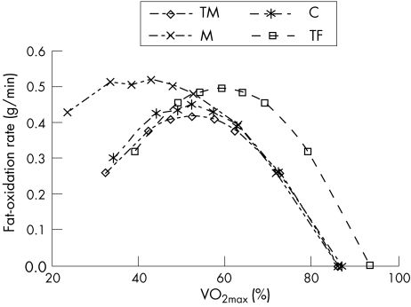

Hi bRo, I'm a cyclist and I want to share my thoughts on cyling nutrition, I'm not a nutritionist so take everything I say with a bit of salt bRo. I belive there's a poor understanding of this topic across the cycling community, I see many daddys going out for 100k rides without food, and many other atrocities...

In this article I will explain why you need to eat way more than what you think.

## Carb the fuck up

So, you may belive that when you're riding at low intensity body can oxidize fat to produce ATP, right? This is true, but only to a certain level. Evidece has discovered that even at very low intensity our body is using also carbohydrates as fuel. Here's some math to prove this:

Let's say we are doing a comfortable Z2 ride, average power 200w for 2h. If we multiply power with time we get energy. We need also to multiply by 4 the result as cycling is about 25% efficient.

$$Energy = 200w*(2\times60\times60)s \times4=5760kJ$$

Pro triathletes, in the best case possible, can oxidize fatty acids at the rate of 0,45 g/min.

values taken from this research: https://www.ncbi.nlm.nih.gov/pmc/articles/PMC2465139/

_Comparison of the relationship of fat‐oxidation rate (g/min) and the relative work intensity (% VO2max) of the different groups studied. C, road cyclists; M, mountain bikers; TF, female triathletes; TM, male triathletes._

Now we can calculate the energy produce by fat oxidation:

$$FatEnergy = 0,45g/min\times60min\times2h\times9kcal/g = 486kcal = 2034kJ$$

The difference of energy is substancial:

$$OtherEnergy = 5760kJ-2034kJ = 3726kJ = 890kcal$$
This energy is produced from other sources: **carbs!** We can even calculate how many grams are used:

$$Carbs = 890kcal/4,2kcal/g = 211g$$

This shows that, even for a comfortable Z2 ride we're using as much as 200g of glycogen. This leds to the main point of the article: we need to fuel while riding, with lots of carbs. Take note that we can store only about 400g of glycogen, so we're buring half of the resevoir.

## Fuel protocol

I'd say that if you're training a lot (>10h a week) it becomes brucial to fuel during every ride, you will feel way less empty every time. As we said before we burn about 100g of carbs every hour, we must reintegrate the loss with minimum 60g/h of carbs. Obviously at higher intensity and races you may need to go as high as 130 g/h but remember that your gut must be trained as well!

The best way to indroduce carbs is by mixing them with water in the bottle, this way is quite convinient because you don't need to carry material food in the pocket, you can have two bottles one really concentrated with carbs and the other plain water. Every sip of carbs you take 2 sips of the other bottle.

Ok bRo, but what carbs do I need to ingest?

Recent research has suggested that the best mix of carbs is the following: maltodextrin (glucose polymer) and fructose, 1:0,8 ratio. https://pubmed.ncbi.nlm.nih.gov/26373645/

Malto:

Fructose:

This mix has the best absorbion rate as the two sugars use different path in the gut. It is also convinient to make your own, maltodextrin is used to makae icecream and it is very cheap, fructose you can find it in every grocery store. I made my own about a month ago, spending 20 € for 2,5 kg of fuel hehehehe

In conclusion, enjoy riding and eating sugal all day bRO.

